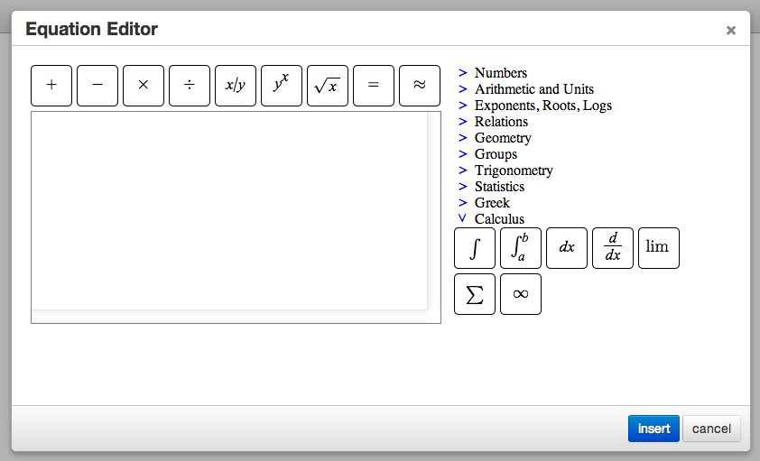

# TinyMCE Equation Editor

## What is this?

Equation Editor plugin for [TinyMCE](http://www.tinymce.com/) that uses [Mathquill](https://github.com/mathquill/mathquill).



## How do I use it?

Refer to [example/example.html](example/example.html) for an example. Note that if you have the repository cloned locally and want to see it in action, you'll need to have it running in a server (i.e. `cd tinymce_equation_editor`; `python -m SimpleHTTPServer` and then going to http://localhost:8000/example/example.html)

Download [tinymce\_equation\_editor.zip](build/tinymce_equation_editor.zip).

You'll get the following files:
- equation_editor.css
- equation_editor.html
- equation_editor.js
- mathquill.css
- mathquill.min.js
- plugin.min.js
- Symbola.[eot|otf|svg|ttf|woff]
- config.json

Put them in your project somewhere publicly available. Everything is assumed to be in the same directory as the page it's being loaded from, with all the `Symbola` files in a `fonts` sub-directory.

The files can be put wherever they make sense in your project with some minor modifications to the referencing code.

Here's an example initialization of TinyMCE. Note that you need to load equation editor plugin and include the CSS and toolbar button:

Anywhere that you display text that could include equations, you will need to include the Mathquill JS and CSS.

```javascript
tinymce.PluginManager.load('equationeditor', '/path/to/plugin.min.js');

tinymce.init({
  selector: 'textarea',
  plugins: 'equationeditor',
  content_css: '/path/to/mathquill.css',
  toolbar: [
    'bold italic underline | bullist numlist | subscript superscript | equationeditor'
  ],
});
```

If you move the font files, just update line 14 in `mathquill.css`.

If you move `equation_editor.html`, update the url in `plugin.min.js`.

If you move the mathquill or equation_editor JavaScript or CSS files, `equation_editor.html` will need the updated paths.

## How do I contribute?

Push that fork button, and then...

### Local Setup

You'll need [npm](https://www.npmjs.org/)

`git clone git@github.com:your_github_username/tinymce_equation_editor.git`

`npm install`


### Pull Requests

Please open pull requests! We'd love to see a configuration management tool for `config.json` (choose from set up pre-made buttons? make new buttons?) and support for installation via Bower (etc). Perhaps plugins for editors other than TinyMCE?

## Under the Covers

Everything is written in CoffeeScript with the relevant files living in `src`. The `dev_example` folder contains `example.html` that uses the CoffeeScript files directly to make debugging things easier.

### events.coffee

This implements a basic event pipeline for passing messages between classes.

### view.coffee

This is the base class for all the view classes. It implements a `$` method to allow easy scoping to the current element. The constructor accepts `$el` for passing a jQuery-ified element or `el` which is then jQuery-ified.

### config.json

This configures what buttons show up where. The basic structure is as follows:

```json
{
  "buttonBar": [
    // button configurations for the top bar
  ],
  "buttonGroups": {
    "basic": [
      {
        "groupName": "First Collapsible Group",
        "buttonViews": [
          // button configurations for the top bar
        ]
      }
    ]
  }
}
```

A button configuration accepts four keys:
- `klass`: the button class to instantiate (e.g. `EquationEditor.Buttons.WriteButtonView`)
- `latex`: the LaTeX code/command that the button will execute
- `buttonText`: the LaTeX code for rendering the button (optional; defaults to the `latex` value)
- `className`: extra classes to apply to the HTML element (optional; always gets "math-button")

A `WriteButtonView` is for writing arbitrary LaTeX and a `CommandButtonView` executes a LaTeX command. For example, executing `\sqrt` as a command will squareroot the current selection, if applicable.

The button groups can be disabled by setting `top.tinymce.equationEditorRestrictions`. For example, if you don't want to confuse elementary-aged kids with calculus buttons, you can set `top.tinymce.equationEditorRestrictions` to `{ disallow_advanced: true }`

By default, all button groups are enabled.

### button_views.coffee

This contains the rendering logic for a single button. When it's clicked, we fire an event on the event pipeline, `EquationEditor.Events` which we will listen for from `EquationEditor.EquationEditorView`.

### button_group_view.coffee

Handles rendering the group name and the contained button views. Also makes itself collapsible using `EquationEditor.CollapsibleView`

### collapsible_view.coffee

A utility class used for handling the hiding/showing of button groups.

### button_view_factory.coffee

Translates button configurations from `config.json` into button instances.

### button_group_view_factory.coffee

Translates button group view configurations from `config.json` into button group view instances. Utilizes `EquationEditor.ButtonViewFactory` to translate the child button views.

### equation_editor_view.coffee

`EquationEditor.EquationEditorView` ties everything together.

It listens for `latex:command` and `latex:write` events fired from the buttons. It fetches the configuration and adds the buttons appropriately. It interacts with the textarea via Mathquill commands.

### equation_editor.html

This is the file opened in the iframe by TinyMCE. It sets up the basic DOM structure which is filled in by the JavaScript. It handles the communication between TinyMCE regarding existing LaTeX (when editing an existing equation) and restrictions. It instantiates the `EquationEditor.EquationEditorView` and gives TinyMCE a reference to it, allowing the plugin to get the contents.

### plugin.coffee

This is the TinyMCE-specific plugin that defines how the plugin behaves. We open `equation_editor.html` with the `mceMathquill` TinyMCE command. It also handles rendering Mathquill-ified LaTeX within TinyMCE and listening for clicks to edit inserted equations.
